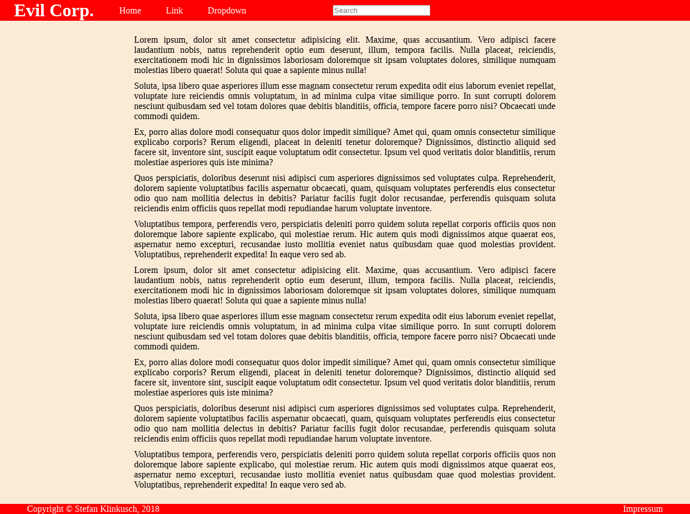
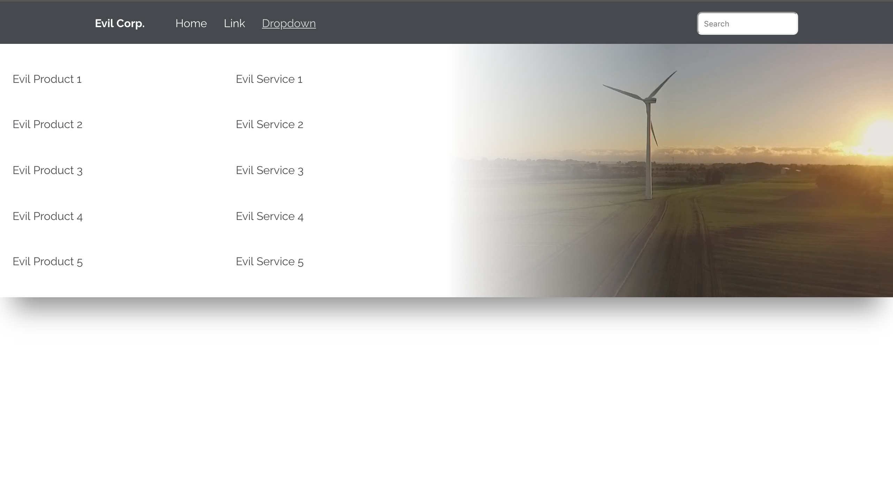

# Mega Menu

This exercise was performed by Stefan Klinkusch at Digital Career Institute in Berlin, Germany using HTML and CSS.

## Features

The webpage features
- a header containing a navbar
- one navitem should invoke a mega menu with an image and further links
- a bit of dummy text
- a footer

## Techniques

- flexbox
- pseudo-selectors (e.g. :hover, :active)
- css variables
- media queries

## Screenshot

## Original Task

Create a mega menu like in the example image. You can create it with a completely different style.

## Scope

Make usage of the following techniques.

- flex
- pseudo selector
- css vars
